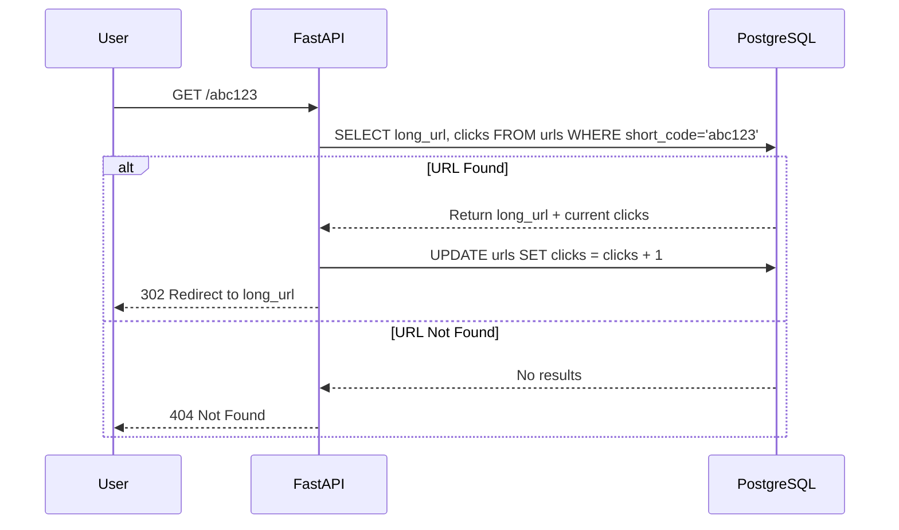

# URL Shortener

A production-ready URL shortening service that transforms long, unwieldy links into concise, shareable URLs. Built with modern web technologies, it offers instant link generation, click tracking, and a clean dashboard for monitoring your links.

**Live Demo:** [https://url-shortner-lgwc.onrender.com](https://url-shortner-lgwc.onrender.com)

---

## Table of Contents
- [Features](#-features)
- [Architecture](#-architecture)
- [How It Works](#-how-it-works)
- [API Reference](#-api-reference)
- [Database Schema](#-database-schema)
- [Tech Stack](#-tech-stack)

---

## Features

### Core Functionality
- **Instant Link Shortening** - Convert any URL into a compact, shareable link
- **Smart Duplicate Detection** - Same URLs always generate identical short codes
- **Click Analytics** - Track how many times each short link is accessed
- **Recent URLs Dashboard** - View your last 5 shortened links with stats

### Technical Highlights
- **Fast Redirects** - Optimized database queries for minimal latency
- **Collision-Free IDs** - Base62 encoding ensures unique, URL-safe short codes

---

## Architecture

```mermaid
graph TB
    subgraph "Frontend"
        A[React App]
        B[Dashboard Page]
        C[URL Form]
    end
    
    subgraph "Backend API"
        D[FastAPI Server]
        E[POST /api/v1/shorten]
        F[GET /{short_code}]
        G[GET /api/v1/urls]
    end
    
    subgraph "Database"
        H[(PostgreSQL)]
        I[urls table]
    end
    
    subgraph "External"
        J[End User]
        K[Target Website]
    end
    
    J -->|Visits| A
    A -->|Submit URL| C
    C -->|API Call| E
    E -->|Store/Retrieve| H
    H --> I
    E -->|Return short URL| A
    
    J -->|Clicks short link| F
    F -->|Lookup code| H
    H --> I
    F -->|Redirect| K
    F -->|Increment clicks| H
    
    A -->|Fetch recent| G
    G -->|Query last 5| H
    H --> I
    G -->|Display stats| B
```

### Data Flow
1. **Link Creation:** User submits URL → Backend checks database → Generates short code → Returns shortened link
2. **Redirection:** User clicks short link → System retrieves original URL → Increments click counter → Redirects to destination
3. **Analytics:** Dashboard fetches recent URLs → Displays with click counts

---

## How It Works

### URL Shortening Logic
The service uses a simple yet effective approach to generate short codes:

```
Database ID (auto-increment) → Base62 Encoding → Short Code
Example: ID 12345 → Base62("12345") → "3d7"
```

### Redirection Flow


---

## API Reference

### Shorten a URL
Creates a new short link or returns existing one for duplicate URLs.

```http
POST /api/v1/shorten
Content-Type: application/json

{
  "long_url": "https://example.com/very/long/path?with=parameters"
}
```

**Response**
```json
{
  "short_url": "https://your-domain.com/3d7",
  "short_code": "3d7",
  "long_url": "https://example.com/very/long/path?with=parameters"
}
```

### Redirect to Original URL
Visiting the short code redirects to the original destination.

```http
GET /{short_code}
```

**Response:** `302 Found` → Redirects to original URL

### Get Recent URLs
Retrieves the last 5 shortened URLs with their statistics.

```http
GET /api/v1/urls
```

**Response**
```json
[
  {
    "id": 12345,
    "long_url": "https://example.com/page",
    "short_code": "3d7",
    "clicks": 42,
    "created_at": "2024-01-15T10:30:00Z"
  },
  {
    "id": 12344,
    "long_url": "https://another.com/link",
    "short_code": "3d6",
    "clicks": 7,
    "created_at": "2024-01-15T09:15:00Z"
  }
]
```

---

## Database Schema

```sql
CREATE TABLE urls (
    id SERIAL PRIMARY KEY,
    long_url TEXT NOT NULL,
    short_code VARCHAR(255) UNIQUE NOT NULL,
    clicks INTEGER DEFAULT 0,
    created_at TIMESTAMP DEFAULT CURRENT_TIMESTAMP
);

-- Performance indexes
CREATE INDEX idx_short_code ON urls(short_code);
CREATE INDEX idx_created_at ON urls(created_at DESC);
```

### Schema Details
| Column | Type | Description |
|--------|------|-------------|
| `id` | SERIAL | Auto-incrementing primary key, used for short code generation |
| `long_url` | TEXT | Original URL (supports up to 2GB) |
| `short_code` | VARCHAR(255) | Unique Base62 encoded identifier |
| `clicks` | INTEGER | Counter tracking number of redirects |
| `created_at` | TIMESTAMP | Auto-set creation timestamp |

---

## Tech Stack

### Backend
| Technology | Purpose |
|------------|---------|
| **FastAPI** | High-performance async web framework |
| **PostgreSQL** | Relational database with ACID compliance |
| **asyncpg** | Asynchronous PostgreSQL driver |
| **Pydantic** | Data validation and settings management |
| **Uvicorn** | ASGI server for production deployment |

### Frontend
| Technology | Purpose |
|------------|---------|
| **React 18** | UI library with hooks-based architecture |
| **TypeScript** | Type-safe JavaScript superset |
| **Vite** | Fast build tool and dev server |
| **React Router** | Client-side routing |
| **Fetch API** | Native HTTP requests |

### Deployment
| Service | Role |
|---------|------|
| **Render** | Hosting platform for both frontend and backend |
| **Render PostgreSQL** | Managed database with automatic backups |

---

## Performance Optimizations

- **Connection Pooling:** Database connections are pooled for efficiency
- **Async Operations:** Non-blocking I/O throughout the stack
- **Indexed Queries:** Optimized lookups on frequently accessed columns
- **Base62 Encoding:** Compact, URL-safe short codes without random generation

---


